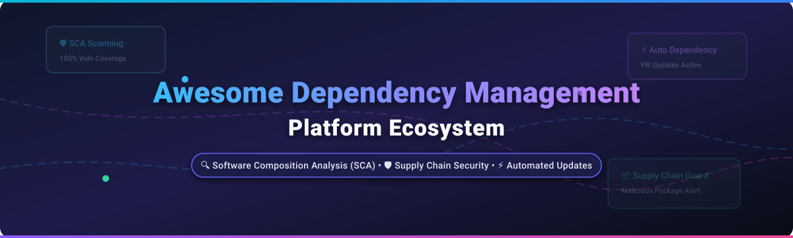

<p align="center">
  
</p>

<p align="center">
  <a href="https://github.com/ishandutta2007/Awesome-Awesome-Awesome"></a><a href="https://discord.gg/jc4xtF58Ve"></a>
  <a href="https://github.com/ishandutta2007/Awesome-Dependency-Management-Platform/stargazers"></a>
  <a href="https://github.com/ishandutta2007/Awesome-Dependency-Management-Platform/network/members"></a>
  <a href="https://github.com/ishandutta2007/Awesome-Dependency-Management-Platform/blob/main/LICENSE"></a>
  <a href="https://github.com/ishandutta2007/Awesome-Dependency-Management-Platform/commits/main"></a>
  <a href="https://github.com/ishandutta2007"></a>
</p>

---

# 🚀 Awesome Dependency Management Platform

> A comprehensive, curated directory of top-tier **Software Composition Analysis (SCA)** tools, **Automated Dependency Update** engines, **Supply Chain Security** platforms, and **SBOM Generators**. Designed for security architects, DevSecOps engineers, and software developers building resilient software pipelines.

---

## 📑 Table of Contents

- [💡 Overview & Market Landscape](#-overview--market-landscape)
- [🏢 SaaS & Commercial Hosted Platforms](#-saas--commercial-hosted-platforms)
- [🔓 Open-Source GitHub Projects](#-open-source-github-projects)
- [🛠️ Key Frameworks & Architecture Recommendations](#%EF%B8%8F-key-frameworks--architecture-recommendations)
- [🤝 How to Contribute](#-how-to-contribute)
- [📈 Star History](#-star-history)
- [💖 Support & Sponsorship](#-support--sponsorship)
- [📜 Disclaimer](#-disclaimer)

---

## 💡 Overview & Market Landscape

Modern applications rely on open-source packages for **70% to 90%** of their codebase. Dependency management platforms enable development teams to systematically track third-party packages, scan for known vulnerabilities (CVEs), automate routine version updates, detect malicious typosquatting attacks, and maintain license compliance.

---

## 🏢 SaaS & Commercial Hosted Platforms

> [!NOTE]
> **📊 Market Size & Industry Structure:** The global Software Composition Analysis (SCA) & Software Supply Chain Security market is estimated at **$1.8 Billion to $2.5 Billion in 2026**, projected to reach over **$5.2 Billion by 2030** (CAGR ~21%). The sector is **moderately fragmented**: while cloud platforms (GitHub/Microsoft) and repository management incumbents (JFrog) anchor standard workflows, specialized security platforms (Snyk, Socket, Black Duck, Aqua) command substantial enterprise share, preventing a single winner-take-all monopoly.

The table below details leading commercial platforms, sorted by **Company Scale** *(Valuation / Market Capitalization / Annual Revenue)* in descending order:

| 🏢 Product / Platform | 📊 Company Scale | 💵 Specific Pricing Tiers | 🎁 Free Tier / Trial Limits | 🔑 Description & Key Capabilities |
| :--- | :--- | :--- | :--- | :--- |
| **[Dependabot](https://github.com/dependabot)** | **Microsoft / GitHub**<br>`~$3.1 Trillion Market Cap`<br>*$245B+ Annual Revenue* | **$0/month** *(Included natively in GitHub Free, Team, Enterprise plans)* | **Free Forever** for unlimited public & private GitHub repositories | Natively integrated into GitHub. Automatically scans dependencies, issues security alerts, and opens pull requests for version updates and CVE fixes. |
| **[JFrog Xray](https://jfrog.com/xray/)** | **JFrog (NASDAQ: FROG)**<br>`~$11.1 Billion Market Cap`<br>*~$600M Annual Revenue* | Starts at **$99/month** *(JFrog Cloud Pro X subscription)* | **30-Day Free Trial** with full binary scanning & SBOM export *(No permanent free tier)* | Deep binary & container image scanning natively integrated with Artifactory. Features continuous impact analysis, Frogbot PR security automation, and SBOM generation. |
| **[Debricked](https://debricked.com/)** | **OpenText (NASDAQ: OTEX)**<br>`~$8.5 Billion Market Cap`<br>*~$5.8B Annual Revenue* | Starts at **$99/month** *(Premium Team tier)* | **Free Forever** for up to 5 developers and 19 repository scans per month | Open-source dependency management focused on team collaboration, custom severity coloring, automated pull request updates, and vulnerability root-cause analysis. |
| **[Snyk Open Source](https://snyk.io/)** | **Snyk Inc.**<br>`~$3.7 Billion Valuation`<br>*~$326M Annual ARR* | Starts at **$25/dev/month** *(Team Plan)* | **Free Forever** ($0/mo); limits: 200–400 SCA tests/mo, 100 SAST tests/mo, 100 Container tests/mo | Developer-first security platform providing automated pull request fixes, actionable risk scoring, reachability analysis, and integration with IDEs and CI/CD pipelines. |
| **[Black Duck](https://www.blackducksoftware.com/)** | **Clearlake / Francisco Partners**<br>`~$2.1 Billion Valuation`<br>*~$500M Annual Revenue* | Starts at **~$800/dev/year** *(~$67/dev/mo)* or ~$75,000/yr enterprise contract | **30-Day Enterprise Trial** upon sales request *(No permanent free tier)* | Enterprise-grade SCA with multi-method identification (code fingerprinting, snippet scanning, binary analysis) backed by a KB indexing 8.7M+ open-source components. |
| **[Aqua Trivy Platform](https://www.aquasec.com/)** | **Aqua Security**<br>`~$1.2 Billion Valuation`<br>*~$100M Annual ARR* | Starts at **$0.80/workload/month** or ~$15/dev/month | **14-Day Free Trial** (up to 250 repository scans); open-source CLI remains free forever | Commercial cloud security platform wrapping Trivy with unified risk prioritization, runtime cloud workload security, and enterprise compliance reporting. |
| **[Sonatype Lifecycle](https://www.sonatype.com/)** | **Vista Equity Partners**<br>`~$1.0 Billion Valuation`<br>*~$100M+ Annual ARR* | Starts at **~$120/dev/year** *(~$10/dev/mo)* or ~$15,000/yr enterprise base | **14-Day Free Trial** for Sonatype Nexus Lifecycle *(No permanent free tier)* | Advanced supply chain policy engine offering precise SBOM management, custom governance policy enforcement, and SAGE offline update support for air-gapped environments. |
| **[Socket](https://socket.dev/)** | **Socket Inc.**<br>`~$1.0 Billion Valuation`<br>*Series C Unicorn ($60M raised 2026)* | Starts at **$25/dev/month** *(Team Plan)* | **Free Forever** ($0/mo); limits: 1,000 scans/month, 3 team members, 70+ risk types | Next-gen supply chain defense using deep static and behavioral analysis to detect typosquatting, install script execution, and poisoned updates without CVE dependencies. |
| **[Mend Renovate Enterprise](https://www.mend.io/)** | **Mend.io**<br>`~$500 Million Valuation`<br>*~$60M Annual ARR* | Starts at **~$25,000/year** *(Enterprise base self-hosted/cloud plan)* | **Free Forever** (Mend Renovate Community Cloud & GitHub App; 1 job runner, 4h intervals) | Enterprise edition of Renovate OSS. Features automated PR grouping, Smart Merge Control, Merge Confidence score ratings, and scalable multi-repo automation. |
| **[FOSSA](https://fossa.com/)** | **FOSSA Inc.**<br>`~$68.9 Million Valuation`<br>*~$9.8M Annual Revenue* | Starts at **~$500/month** *(~$6,000/year team tier)* | **14-Day Free Trial** with unlimited scans; free tier available for open-source maintainers | License compliance and open-source risk management platform guaranteeing 99.8% license scanning accuracy across 17+ programming languages and 20+ build systems. |

---

## 🔓 Open-Source GitHub Projects

The dependency management ecosystem features a vibrant open-source landscape. Below are top-tier open-source tools sorted by **GitHub Stars** in descending order:

1. **[Trivy](https://github.com/aquasecurity/trivy)** [](https://github.com/aquasecurity/trivy/stargazers)  
   *Comprehensive, versatile open-source security scanner maintained by Aqua Security. Scans container images, local filesystems, Git repositories, Kubernetes configurations, secrets, and SBOMs.*

2. **[Renovate OSS](https://github.com/renovatebot/renovate)** [](https://github.com/renovatebot/renovate/stargazers)  
   *The gold-standard open-source automated dependency update tool (AGPL-3.0). Supports npm, pip, Maven, Gradle, Go, Docker, Helm, Terraform, and seamlessly creates pull requests across GitHub, GitLab, Bitbucket, and Azure DevOps.*

3. **[Grype](https://github.com/anchore/grype)** [](https://github.com/anchore/grype/stargazers)  
   *Fast vulnerability scanner for container images and filesystems developed by Anchore. Optimized for SBOM-first scanning workflows when paired with Syft.*

4. **[OSV-Scanner](https://github.com/google/osv-scanner)** [](https://github.com/google/osv-scanner/stargazers)  
   *Google's open-source vulnerability scanner powered by the Open Source Vulnerabilities (OSV) database. Provides precise, ecosystem-specific CVE matching for project dependencies and SBOMs.*

5. **[Syft](https://github.com/anchore/syft)** [](https://github.com/anchore/syft/stargazers)  
   *CLI tool and Go library for generating a Software Bill of Materials (SBOM) from container images and filesystems in SPDX, CycloneDX, and Syft native formats.*

6. **[OWASP Dependency-Check](https://github.com/dependency-check/DependencyCheck)** [](https://github.com/dependency-check/DependencyCheck/stargazers)  
   *Mature, battle-tested OWASP Software Composition Analysis (SCA) tool. Detects publicly disclosed vulnerabilities in project dependencies across Java, .NET, JavaScript, Python, Ruby, and C/C++.*

7. **[Cosign](https://github.com/sigstore/cosign)** [](https://github.com/sigstore/cosign/stargazers)  
   *Container signing, verification, and storage in an OCI registry. Part of the Linux Foundation's Sigstore project for securing software supply chains.*

8. **[Dependabot Core](https://github.com/dependabot/dependabot-core)** [](https://github.com/dependabot/dependabot-core/stargazers)  
   *The core open-source engine powering GitHub's native Dependabot service. Handles parsing manifest files, fetching dependency updates, and generating automated PR changes.*

9. **[OWASP Dependency-Track](https://github.com/DependencyTrack/dependency-track)** [](https://github.com/DependencyTrack/dependency-track/stargazers)  
   *Intelligent Software Supply Chain Component Analysis platform. Consumes CycloneDX SBOMs to continuously monitor component vulnerabilities across an entire organization.*

10. **[GUAC (Graph for Understanding Artifact Composition)](https://github.com/guacsec/guac)** [](https://github.com/guacsec/guac/stargazers)  
    *Aggregates software security metadata (SBOMs, SLSA attestations, OSV findings) into a unified graph database to answer complex security and supply chain queries.*

11. **[pip-audit](https://github.com/pypa/pip-audit)** [](https://github.com/pypa/pip-audit/stargazers)  
    *Official PyPA tool for scanning Python environments and dependency manifests for known vulnerabilities using the PyPI JSON API and OSV database.*

12. **[cdxgen](https://github.com/cdxgen/cdxgen)** [](https://github.com/cdxgen/cdxgen/stargazers)  
    *Multi-language CycloneDX SBOM generator supporting Java, JavaScript, Python, Go, Rust, C/C++, Ruby, PHP, .NET, Android, and iOS.*

13. **[in-toto](https://github.com/in-toto/in-toto)** [](https://github.com/in-toto/in-toto/stargazers)  
    *Framework to verify the integrity of the software supply chain from development to deployment by recording and verifying cryptographic attestations at every step.*

14. **[Updatecli](https://github.com/updatecli/updatecli)** [](https://github.com/updatecli/updatecli/stargazers)  
    *Declarative, policy-driven dependency update automation tool using YAML definitions. Supports files, Docker images, Helm charts, Terraform providers, and Git repositories.*

15. **[Socket CLI](https://github.com/SocketDev/socket-cli)** [](https://github.com/SocketDev/socket-cli/stargazers)  
    *Open-source CLI tool for Socket.dev. Enables developers to run local security scans, perform package scoring, generate SBOMs, and auto-fix vulnerable packages (`socket fix`).*

---

## 🛠️ Key Frameworks & Architecture Recommendations

To build an enterprise-grade, cost-effective dependency management pipeline using open-source tools:

```
[ Developer Commit / PR ]
         │
         ▼
[ Renovate OSS ] ──────► Automatically creates PRs for outdated dependencies
         │
         ▼
[ Syft / cdxgen ] ────► Generates CycloneDX / SPDX SBOM at build time
         │
         ▼
[ Trivy / Grype ] ────► Scans SBOM & filesystem against OSV / NVD databases
         │
         ▼
[ Socket CLI ] ────────► Performs behavioral threat checks for malicious code/scripts
         │
         ▼
[ Dependency-Track ] ─► Stores & continuously monitors SBOM risk post-deployment
```

---

## 🤝 How to Contribute

Contributions are highly appreciated! To submit a new tool, update pricing info, or refine listings:

1. Fork the repository `https://github.com/ishandutta2007/Awesome-Dependency-Management-Platform`.
2. Create a feature branch (`git checkout -b feature/add-new-tool`).
3. Commit your changes with clear context (`git commit -m 'Add ToolName to SaaS table'`).
4. Push to your branch (`git push origin feature/add-new-tool`).
5. Open a Pull Request.

Please refer to the curated guidelines on [Awesome-Awesome-Awesome](https://github.com/ishandutta2007/Awesome-Awesome-Awesome).

---

## 📈 Star History

[](https://star-history.dera.page/#ishandutta2007/Awesome-Dependency-Management-Platform&type=date&legend=top-left)

---

## 💖 Support & Sponsorship

Thank you for visiting and using this resource! If you find this curated ecosystem list helpful for your security workflows or technical research, please consider supporting the project:

- ⭐ **Star this repository** to help others discover it on GitHub.
- 🍴 **Fork the repo** to keep your own reference copy or contribute updates.
- 📢 **Share with your team** and network on LinkedIn, Twitter/X, or Reddit.
- ☕ **Buy Me a Coffee / Sponsor**: Support ongoing maintenance via the [GitHub Sponsor Dashboard](https://github.com/sponsors/ishandutta2007).

---

## 📜 Disclaimer

*This repository is maintained for educational and informational purposes. Product names, logos, valuations, and registered trademarks belong to their respective corporate owners. Pricing and plan limits are based on publicly disclosed tier specifications as of 2026 and are subject to change by vendors.*
